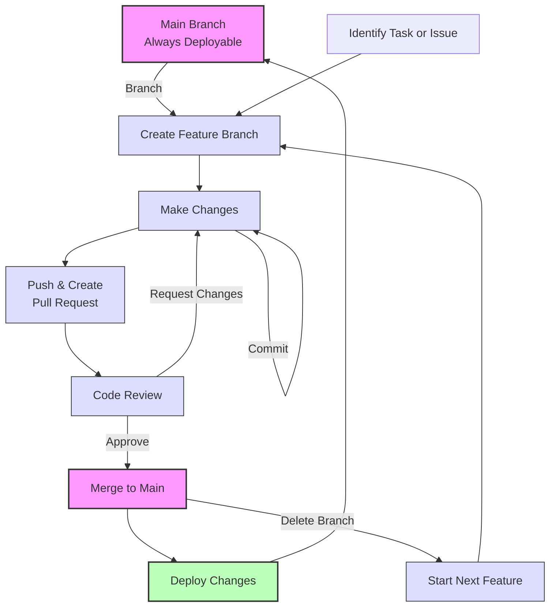

# GitHub Repository Setup Instructions

Follow these steps to create a new GitHub repository and push your existing code:

## 1. Create a New Repository on GitHub

1. Go to [GitHub](https://github.com/) and sign in to your account
2. Click on the "+" icon in the top-right corner and select "New repository"
3. Enter a name for your repository (e.g., "apply-backend")
4. Optionally, add a description
5. Choose whether the repository should be public or private
6. **Important**: Do NOT initialize the repository with a README, .gitignore, or license as you already have an existing project
7. Click "Create repository"

## 2. Link Your Local Repository to GitHub

After creating the repository, GitHub will show you commands to push an existing repository. Follow these steps in your terminal:

```bash
# Add the GitHub repository as a remote (replace USERNAME with your GitHub username and REPO_NAME with your repository name)
git remote add origin https://github.com/USERNAME/REPO_NAME.git

# Verify that the remote was added successfully
git remote -v
```

## 3. Commit Your Changes

Before pushing to GitHub, make sure to commit all your changes:

```bash
# Add all files to staging
git add .

# Commit the changes
git commit -m "Initial commit"
```

## 4. Push Your Code to GitHub

```bash
# Push your code to GitHub
git push -u origin main
```

## 5. Verify Your Repository

1. Go to your GitHub repository page (https://github.com/USERNAME/REPO_NAME)
2. Confirm that all your files have been uploaded correctly
3. Your README.md should be displayed on the repository's main page

## 6. Using Semantic Commits

Semantic commits are a convention for creating meaningful commit messages that clearly communicate the purpose of a change. Following this convention makes your commit history more readable and helps automate versioning and changelog generation.

### Format

```
<type>(<scope>): <description>

[optional body]

[optional footer(s)]
```

### Types

- `feat`: A new feature
- `fix`: A bug fix
- `docs`: Documentation changes
- `style`: Code style changes (formatting, missing semi-colons, etc.; no code change)
- `refactor`: Code refactoring (neither fixes a bug nor adds a feature)
- `perf`: Performance improvements
- `test`: Adding or correcting tests
- `chore`: Changes to the build process, auxiliary tools, libraries, etc.

### Examples

```bash
# Adding a new feature
git commit -m "feat(auth): add OAuth2 authentication"

# Fixing a bug
git commit -m "fix(api): resolve null pointer in user controller"

# Updating documentation
git commit -m "docs: update installation instructions"

# Refactoring code
git commit -m "refactor(core): simplify data processing logic"
```

### Benefits

- **Clear Communication**: Team members can easily understand the purpose of each commit
- **Automated Versioning**: Tools like semantic-release can automatically determine version numbers
- **Better Changelogs**: Generate meaningful changelogs automatically
- **Easier Maintenance**: Makes it simpler to navigate and understand the project history

## 7. GitHub Flow Collaboration Model

We follow the GitHub Flow branching model for collaboration. This is a lightweight, branch-based workflow that supports teams and projects where deployments are made regularly.

### Core Principles

1. The `main` branch is always deployable and contains production-ready code
2. All new work is done in feature branches created from the `main` branch
3. Pull requests are used for code review before merging back to `main`
4. Changes are deployed immediately after merging to `main`

### Visual Workflow



### Workflow Steps

#### 1. Create a Feature Branch

Always create a new branch for your work, branching off from `main`:

```bash
# Ensure you're on main and it's up to date
git checkout main
git pull origin main

# Create a new feature branch with a descriptive name
git checkout -b feature/descriptive-feature-name
```

Use a descriptive name that reflects what you're working on. Prefixes like `feature/`, `fix/`, `docs/`, etc., help categorize the branch.

#### 2. Make Changes and Commit

Work on your feature branch, making regular commits using the semantic commit format:

```bash
# Add your changes
git add .

# Commit with semantic message
git commit -m "feat(component): add new functionality"
```

#### 3. Push to GitHub

Push your branch to the remote repository:

```bash
git push -u origin feature/descriptive-feature-name
```

#### 4. Create a Pull Request

1. Go to the repository on GitHub
2. Click "Compare & pull request" for your recently pushed branch
3. Fill in the PR template with:
   - Clear description of changes
   - Reference to any related issues
   - Screenshots or other supporting materials if applicable
4. Click "Create pull request"

#### 5. Code Review Process

- At least one team member should review each PR
- Reviewers should check for:
  - Code quality and correctness
  - Test coverage
  - Documentation
  - Adherence to project standards
- Address all feedback through additional commits to the same branch

#### 6. Merge and Deploy

Once approved:
1. Merge the PR into `main` (prefer "Squash and merge" for a cleaner history)
2. Delete the feature branch after successful merge
3. The changes will be automatically deployed through our CI/CD pipeline

#### 7. Start Your Next Feature

Begin the process again by creating a new branch from the updated `main`.

### Best Practices

- Keep branches short-lived (days, not weeks)
- Make regular, small commits with clear messages
- Update your feature branch regularly with changes from `main` to avoid conflicts
- Write and update tests for your changes
- Document new features or API changes

## Additional Tips

- Consider setting up branch protection rules for your main branch
- Set up GitHub Actions for CI/CD if needed
- Invite collaborators to your repository if you're working with a team
